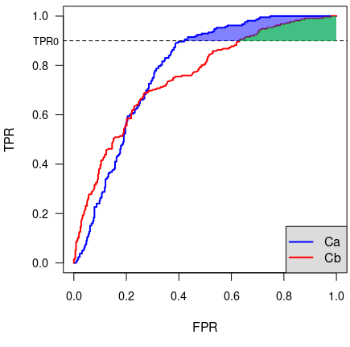

# ISIC 2024 - Skin Cancer Detection with 3D-TBP
URL: https://www.kaggle.com/competitions/isic-2024-challenge

## 概要
###  課題
3D全身画像（TBP）から切り取ったから病変部分の画像を用いて皮膚がんの特定するための画像ベースのアルゴリズムを開発 
→ 専門的な診察ができない環境で利用することで、早期皮膚がん検出に貢献できる
### 用語

ダーモスコピー

あ

メラノーマ

あ

基底細胞がん

あ

扁平上皮がん

あ

トリアージ

あ

形態学的

あ

プライマリケア

あ

## データセット
### 概要
- 訓練データセット（train.csv）
- テストデータセット（test.csv）
### 説明変数
|変数名|定義|Key|
|:----|:----|:----|
|survival|生存しているかどうか|0:No, 1:Yes|
|pclass|社会経済的地位| 1:1st, 2:2nd, 3:3rd|
|sex|性別||
|Age|年齢||
|sibsp|タイタニック号に搭乗した兄弟/姉妹/配偶者の数||
|parch|タイタニック号に搭乗した親子の人数||
|ticket|チケット番号||
|fare|旅客運賃||
|cabin|キャビン番号||
|embarked|乗船港|C:Cherbourg, Q:Queenstown, S:Southampton|
### 評価指標
二値分類における真陽性率（TPR）以上の部分のROC曲線下の部分面積（pAUC）
$$\text{pAUC} = \int_{0.8}^{1} \text{TPR}(t) \, d(\text{FPR}(t))$$

  

## 提出ログ
|日付|精度|モデル|パラメータ|工夫した点|
|:---|:---|:---|:---|:---|

## アイデア

## TODO
- ドメイン知識の獲得
  - 意味単語調べ
  - Discussionで情報収集
  - EDA
- データセット調べ